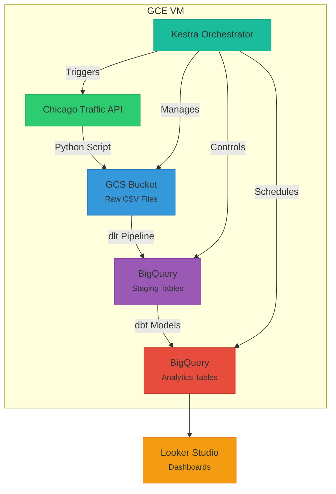

## Helping Chicagoans Avoid Traffic Headaches

### The Everyday Struggle
If you've ever driven a car in Chicago you know how crazy traffic can be. To help drivers plan out commutes, I used traffic data from Chicago Data Portal to analyse traffic speeds in different regions throughout the Chicago area.  

---

### Dashboard
insert screenshot

#### "When Should I Leave?"  
**Hourly speed trends show:**  
- Best/worst times to drive through specific areas  

**Daily speed trends show:**  
- Best/worst days to drive through specific areas  

#### "Which Route is Faster?"  
**Regional speed comparisons reveal:**  
- Consistent bottlenecks
- Possible hidden shortcuts

---

### Traffic Analytics Pipeline Architecture

#### Overview
A batch processing data pipeline that transforms csv Chicago traffic API data into actionable insights for commuters.

#### Tech Stack

| Component              | Purpose                                                                 | Key Features Used                     |
|------------------------|-------------------------------------------------------------------------|---------------------------------------|
| **Google Compute Engine (GCE)** | Hosts pipeline execution environment                                  | - Docker container runtime for kestra            |
| **Kestra (Docker)**     | Workflow orchestration                                                 | - Scheduled job execution - Dependency management |
| **Google Cloud Storage**     | Datalake                                               | - Destination for extracted csv files |
| **BigQuery**     | Data Warehouse                                              | - Tables/views for analytics  |
| **dlt**     | ETL                                             | - Extract data from GCS and load it into BigQuery  |
| **dbt**     | Transformations                                             | - Create fact/dimension tables for analytics  |
| **terraform**     | IaC Deployments                                             | - Ease redeployment of required cloud resources  |

---

