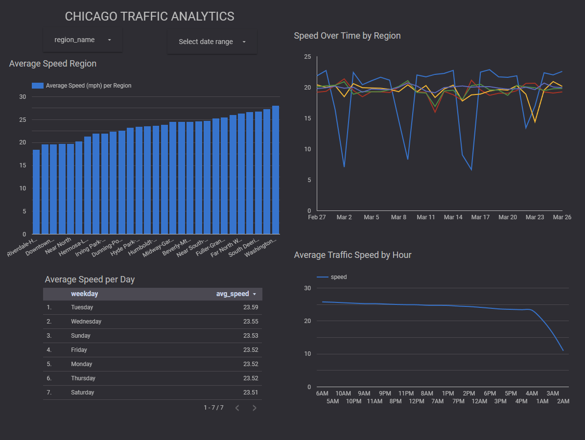
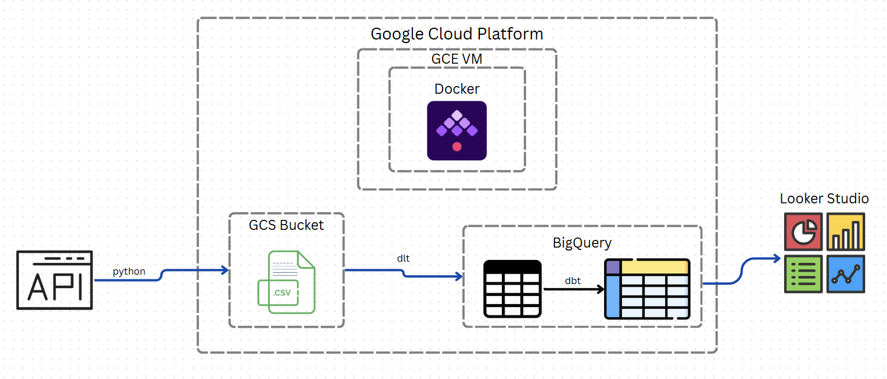

# Chicago Traffic Insights  

## The Problem  
Navigating Chicago's streets often feels like a gamble. You might leave at what seems like a good time, only to find yourself stuck in gridlock with no clear explanation. While apps like Google Maps show real-time traffic, they don't answer the questions Chicago drivers really care about:  
- When is the *optimal time* to start my commute?  
- Which alternate route *consistently* performs better?
- How much did last night's event *actually delay* my drive home?  

## The Solution  
This project transforms raw traffic data from the Chicago Data Portal into clear, actionable patterns:  

**Time Intelligence**  
Discover that rush hour starts earlier than you think - the Loop slows down by 3:30 PM, not 5 PM. See how Saturday midday traffic flows 25% faster than Friday afternoons.  

**Route Comparisons**  
Compare traffic in regions to find the best route through the city.

**Event Impacts**  
View data for specific date by hour to see how events have affect traffic in the past.

---

## Dashboard

[Link to view dashboard](https://lookerstudio.google.com/reporting/c6637050-b11f-45ce-b5f3-87fe0f37bda5)

#### "When Should I Leave?"  
**Hourly speed trends show:**  
- Best/worst times to drive through specific areas  

**Daily speed trends show:**  
- Best/worst days to drive through specific areas  

#### "Which Route is Faster?"  
**Regional speed comparisons reveal:**  
- Consistent bottlenecks
- Possible hidden shortcuts

---

## Traffic Analytics Pipeline Architecture

### Overview
A batch processing data pipeline that transforms csv Chicago traffic API data into actionable insights for commuters. It is scheduled to run daily with backfill options available.

### Tech Stack

| Component              | Purpose                                                                 | Key Features Used                     |
|------------------------|-------------------------------------------------------------------------|---------------------------------------|
| **Google Compute Engine (GCE)** | Hosts pipeline execution environment                                  | - Docker container runtime for kestra            |
| **Kestra (Docker)**     | Workflow orchestration                                                 | - Scheduled job execution - Dependency management |
| **Google Cloud Storage**     | Datalake                                               | - Destination for extracted csv files |
| **BigQuery**     | Data Warehouse                                              | - Tables/views for analytics  |
| **dlt**     | ETL                                             | - Extract data from GCS and load it into BigQuery  |
| **dbt**     | Transformations                                             | - Create fact/dimension tables for analytics  |
| **terraform**     | IaC Deployments                                             | - Ease redeployment of required cloud resources  |

## BQ Tables

I used dbt to transform the data from the staging tables. I created additional fact and dimension tables to help with analyzing regional and time-based traffic.

| Table Name          | Partition/Cluster       | Description                          |
|---------------------|-------------------------|--------------------------------------|
| stg_traffic_raw     | none                    | Raw API data                         |
| fct_traffic                 | Parition: date/Cluster: region_id  | Incrementally loaded. Cleaned data, partitions/cluster to help optimize queries for date and regions.  |
| fct_avg_speed_by_region_hour            | Parition: region_id | Average speeds per hour for each region, partitions help for querying regional data.|
| dim_region                 | none                    | Region descriptions.                                  |
| dim_date                 | none                    | Breakdown of dates by hour,month,year, and day.                                 |

---

### Deployment

Follow instructions laid out [here](INSTRUCTIONS.md)

---

