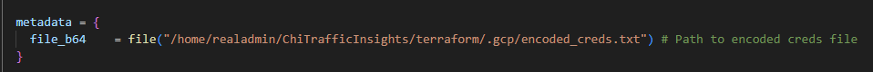
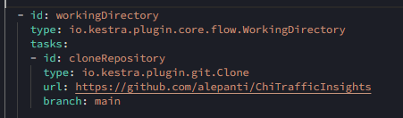

# Clone Repo (Optional)
Pipeline is set to run off this repository so it will run successfully regardless. To make your own changes, you must create/clone this repo.

# Set up Google Cloud Project
1. Create a Google Cloud Project
2. Create a Service Account 
    Don't worry about roles, terraform will cover that.
3. Generate JSON key for Service Account. 
    Save key locally.
4. Create encoded_creds.txt file.
    Run the following command (linux) to encode your credentials:
    ```
    base64 /path/to/credentials.json > encoded_creds.txt
    ```
    This encoded file will be used to add .json to GCE VM.

# Deploy Resources with Terraform
1. Terraform client installation: https://www.terraform.io/downloads
2. Create/copy terraform files outlined [here](terraform)
    variables.tf: Update with your project id and intended resource names.
    main.tf: Update metadata with the path to your encoded_creds.txt file we created earlier.
    
3. Deploy resources with the following commands:
    ```
    terraform init
    terraform plan
    terraform apply
    ```
4. Wait for resources to load.
    The docker container can take a couple minutes to load in the VM. Be patient.

# Create Kestra flows
1. Access Kestra by navigating to the public API of your VM on 8080, e.g. http://55.555.55.55:8080
2. Create the flows outlined [here](kestra)
    kv.yaml: Add the json of you service account credentials under gcp_creds.
    main.yaml: If you would like to run pipeline off your own repo, change the url under workingDirectory task:
        